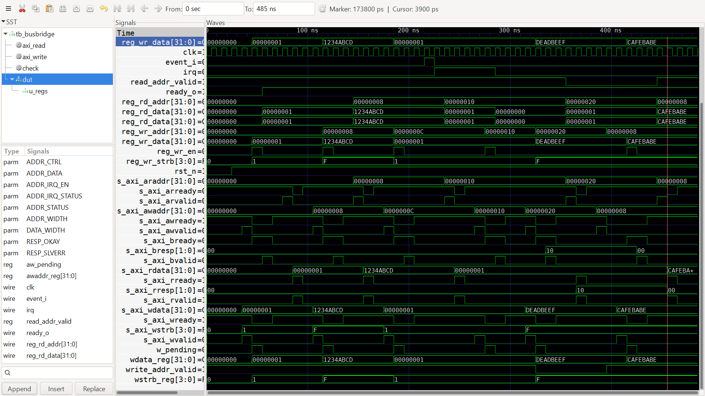

# BusBridge AXI4-Lite Verification Report

## 1. Verification Overview

The BusBridge AXI4-Lite peripheral IP was verified using a SystemVerilog directed testbench with Icarus Verilog.

The verification environment checks AXI4-Lite read/write operation, register functionality, interrupt behavior, error responses, and independent write address/data channels.

## 2. Verification Tests

| Test | Result |
|---|---|
| CTRL write/read | PASS |
| DATA write/read | PASS |
| IRQ assertion after event | PASS |
| IRQ status set | PASS |
| IRQ clear | PASS |
| Invalid write returns SLVERR | PASS |
| Invalid read returns SLVERR | PASS |
| Independent AW/W channels | PASS |

## 3. Protocol Checks

The testbench includes checks for AXI4-Lite channel stability:

- AW address stability while `AWVALID` is asserted and `AWREADY` is low.
- W data and write-strobe stability while `WVALID` is asserted and `WREADY` is low.
- B response stability while `BVALID` is asserted and `BREADY` is low.
- R data and response stability while `RVALID` is asserted and `RREADY` is low.

No protocol check failures were reported during simulation.

## 4. Final Results

```text
PASSED : 8
FAILED : 0
RESULT : ALL TESTS PASSED

## Waveform Evidence

The BusBridge AXI4-Lite IP was simulated using Icarus Verilog.

The simulation generated the waveform file:

`sim/busbridge.vcd`

The waveform was inspected using GTKWave and shows AXI4-Lite transactions, register accesses, interrupt handling, and response signals.

